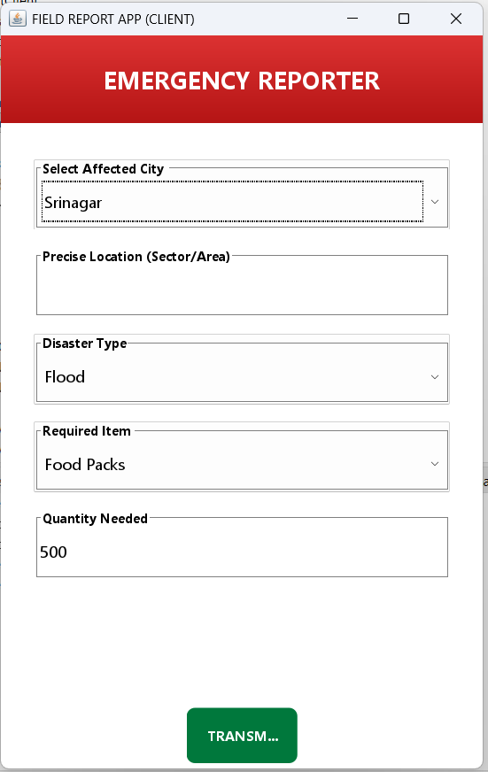
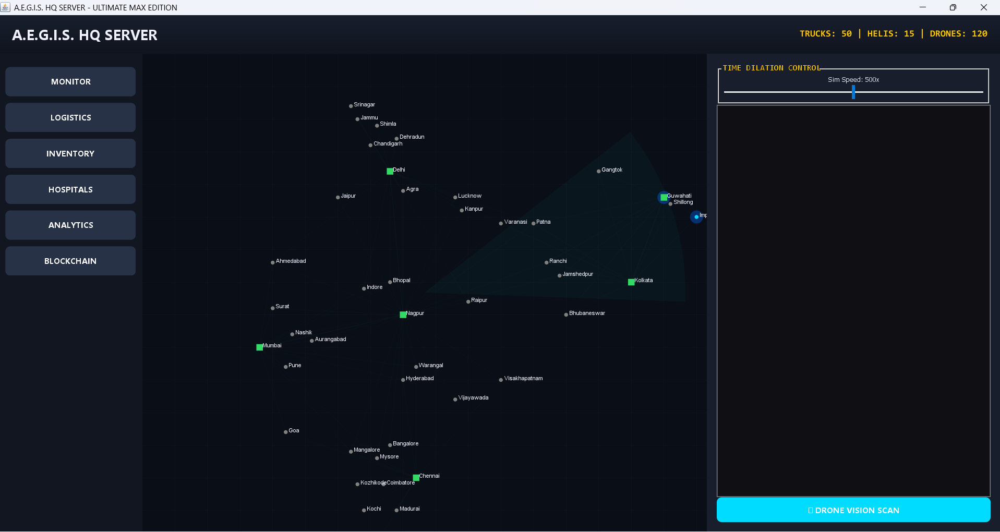
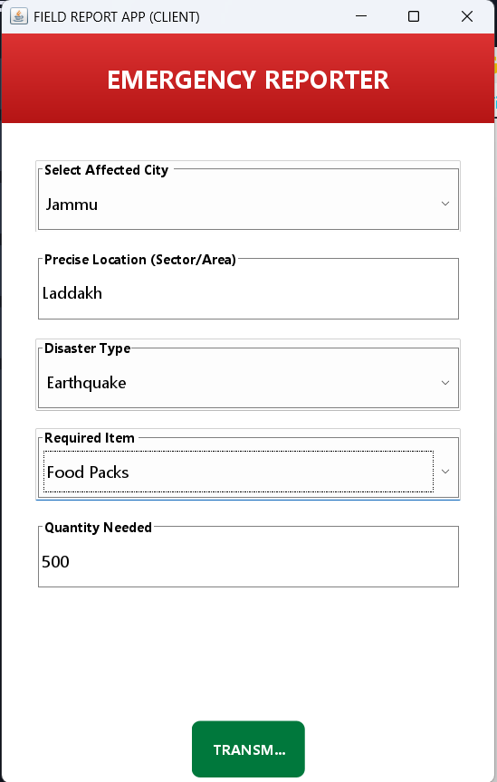
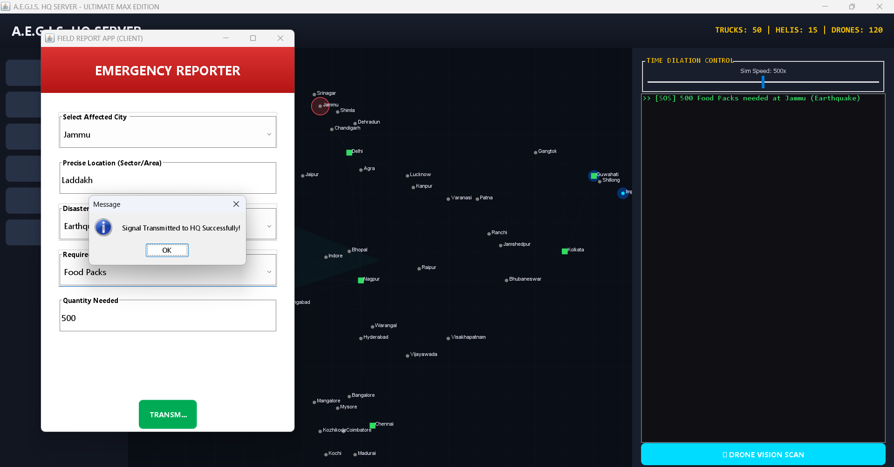
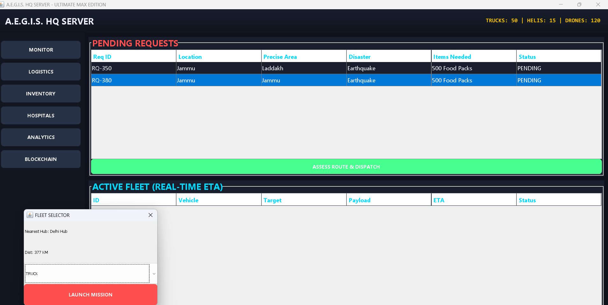
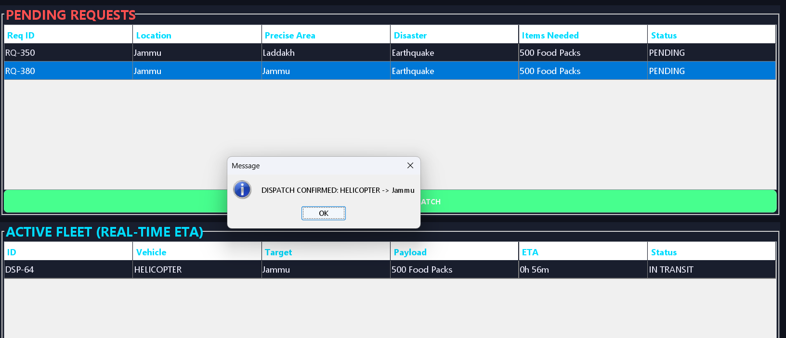

# A.E.G.I.S.
### Advanced Emergency Grid & Inventory System

A.E.G.I.S. is a Java-based real-time disaster response and logistics management system built using a Client-Server architecture.

## 🚀 Features

- Real-time disaster reporting
- Centralized command dashboard
- Live geospatial visualization
- Multi-modal logistics (Trucks, Helicopters, Drones)
- Multi-threaded vehicle simulation
- AI-based demand prediction (simulated)
- Blockchain-based dispatch tracking (SHA-256)

## 🛠 Tech Stack

- Java (JDK 17+)
- Java Swing & AWT
- Multi-threading
- OOP Concepts
- Java Collections Framework

## 📊 System Architecture

Client-Server model where:
- Client reports incidents
- Server manages inventory & dispatch

## 📸 Project Output

(Screenshot will be added here)

---

## 👨‍💻 Developed By
Ziyaurrahman and Team

---

## 📌 Future Scope

- Google Maps API integration
- IoT tracking
- Cloud database
- Mobile app integration
## 📸 Project Output

### 🖥 Main Dashboard

### 🗺 Map & Visualization

### 🚛 Logistics Simulation

### 📊 Analytics & Dispatch

